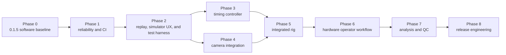

# Driftless Bundle Photometry Development Roadmap

This roadmap is the living development plan for Driftless Bundle Photometry (DBF).
It turns the scientific invariants and implementation gates in `AGENTS.md` into
sequenced work that can be planned, reviewed, tested, and released.

The roadmap describes intended work, not validated capability. A phase is complete
only when its exit criteria are supported by automated tests and, where required,
physical measurements. Simulator results never count as physical hardware
validation.

**Current baseline:** 0.1.6

**Last updated:** 2026-09-01

## How to use this roadmap

- Work phases in dependency order. Do not bypass a failing exit criterion.
- Put user-visible changes in the `Unreleased` section of `WHATS_NEW.md` as they
  land; move them to a version section only when that version is released.
- Split each deliverable into an issue with an owner, acceptance tests, and links to
  any design decision or bench report it requires.
- Mark an item complete only after code, tests, documentation, and failure behavior
  are all present.
- Record physical validation with the exact hardware, firmware, wiring, software
  version, test method, and measured result.
- Revisit phase scope after every release. Add new work to the earliest phase whose
  exit criteria it affects.

## Status language

| Status | Meaning |
| --- | --- |
| Complete | Implemented and verified at the level claimed by the phase. |
| Next | The active planning target; new feature work should begin here. |
| Planned | Sequenced, but blocked by an earlier phase or an unresolved decision. |
| Hardware required | Cannot be completed honestly without the physical Windows rig. |

## Roadmap at a glance

Controller and camera development may proceed in parallel after the replay and
integration harness exists. They join at the integrated-rig gate. Analysis algorithms
may be prototyped with synthetic data earlier, but their phase cannot close until the
acquisition and time base feeding them have passed integrated validation.

| Phase | Outcome | Status | Primary dependency |
| --- | --- | --- | --- |
| 0 | Trace-first simulator and NWB software baseline | Complete | — |
| 1 | Repeatable software reliability and continuous integration | Next | Phase 0 |
| 2 | Deterministic replay, simulator workflow, and integration harness | Planned | Phase 1 |
| 3 | Safe deterministic timing controller | Hardware required | Phase 2 |
| 4 | Characterized CS505MU camera backend | Hardware required | Phase 2 |
| 5 | One-clock, end-to-end Windows acquisition rig | Planned | Phases 3 and 4 |
| 6 | Hardware-backed calibration and recording workflow | Planned | Phase 5 |
| 7 | Reproducible derived analysis and QC | Planned | Phases 5 and 6 |
| 8 | Installable, documented, release-quality product | Planned | All earlier gates |

## Phase 0 — 0.1.5 software baseline

**Status: Complete as the 0.1.5 baseline; known contract gaps move to Phase 1**

### Delivered

- Immutable validation for sessions, cameras, 1–9 circular fiber ROIs, 1–3
  excitation channels, and four TTL inputs.
- Deterministic wavelength schedules, controller tick handling, circular ROI masks,
  and signal extraction with unit tests.
- A simulator that emits explicit exposure identity, original `uint16` frames, and
  both TTL edge directions.
- An explicit acquisition state machine and headless acquisition engine.
- Bounded, checksummed recovery spools with background-writer failure reporting.
- NWB finalization, PyNWB validation, NWB Inspector checks, reopen verification, and
  atomic promotion of one validated file per ROI and animal.
- A trace-first PySide6/pyqtgraph demo with draggable calibration ROIs, per-ROI
  subject metadata, slider-based excitation voltage controls, and independent live
  camera panels for each excitation wavelength.
- Selectable live-trace horizons with screen-width-bounded, extrema-preserving
  display aggregation for long recordings.
- One independently scaled trace row per ROI, with wavelength overlays, per-color
  visibility controls, and Absolute or display-only dF/F rendering based on an
  explicit per-ROI/per-wavelength baseline window.
- Exact cross-ROI x-range synchronization, dominant-axis drag-box zoom,
  double-click reset, wheel-to-page routing, and styled page scrollbars.
- Versioned complete JSON save/load/default settings, redirected Windows Documents
  discovery, exact NWB settings snapshots, and warning-based legacy NWB import.
- Recoverable per-wavelength camera references and derived ROI-annotated diagnostic
  images embedded in every per-ROI NWB output.
- A versioned controller codec, lifecycle guard, and single-owner serial transport
  tested against fake serial devices.
- Source and wheel installation, a Conda environment definition, and the short
  `dbf` command.

### Baseline limitations

- The Thorlabs module detects SDK availability but is not a complete or physically
  validated camera transport.
- There is no controller firmware or electrically characterized DAC/LED driver.
- Camera frames are not yet matched to physical controller exposure records.
- There is no NWB replay service or supported derived-analysis pipeline.
- The desktop application is simulator-backed; it is not an acquisition claim for
  the physical rig.

## Phase 1 — Reliability closure and continuous integration

**Status: Completed in Unreleased**

**0.1.6 foundation:** The versioned v1 JSON format, complete GUI save/load/default
workflow, redirected-Windows-Documents location, exact NWB settings snapshots, and
warning-based legacy NWB import are implemented with round-trip tests. Explicit
future-format migrations and broader provenance remain in this phase. The live trace
workspace also has exact cross-ROI x-range synchronization, dominant-axis drag-box
zoom, double-click reset, wheel-to-page routing, and bounded rendering tests.
The simulator GUI now requires a non-writing acquisition preflight before each
recording and invalidates that approval when recording-relevant settings change. The
same preview validation contract must be exercised by physical adapters in Phases 3-5.
The Windows/macOS Python 3.11-3.13 CI matrix and isolated core/GUI wheel smoke gates
are implemented in 0.1.6. Unreleased work closes the native canonical data contract:
actual per-exposure voltage commands, host receipt times, ROI saturation QC,
excitation events, invalid intervals, runtime provenance, and recoverable spool-v1
limitations now round-trip explicitly. Unreleased reliability closure adds typed
fault journaling, deterministic coverage for every listed software fault, safe spool
inspection/discovery, idempotent interrupted recovery, structured diagnostics,
storage preflight, and small-fixture capacity bounds. A future configuration version
must add its migration at the same time it is introduced; unknown versions remain
rejected.

### Goal

Make the software-only system reproducible on every supported Python and operating
system before connecting it to physical devices.

### Deliverables

1. **Continuous integration — completed in 0.1.6**
   - Run lint, formatting, unit tests, NWB validation, and wheel installation on
     Windows and macOS.
   - Exercise supported Python 3.11–3.13 versions and the exact bounded
     PyNWB/HDMF/NDX combination.
   - Add a clean-wheel smoke test for `dbf --version`, headless acquisition, GUI
     import, and packaged logo availability.

2. **Complete fault-injection coverage — implemented in Unreleased**
   - Retain existing stop, drop-event, non-monotonic sequence/tick, spool corruption,
     writer failure, and finalizer failure tests.
   - Add deterministic tests for queue saturation, malformed controller streams,
     camera disconnect, controller disconnect, clock discontinuity, insufficient
     disk space, GUI close while recording, and GUI close while draining.
   - Verify every failure becomes an event or surfaced error and leaves a recoverable
     spool when committed data exists.

3. **Canonical data-contract closure — implemented in Unreleased**
   - Persist actual commanded intensity for every exposure instead of reconstructing
     it from the initial channel configuration.
   - Add explicit excitation-event records alongside camera exposure, TTL, dropped-
     frame, and system-event records.
   - Represent bad continuous spans in `invalid_times`/`TimeIntervals` and retain the
     source event or reason that created each interval.
   - Add round-trip assertions for every required table, column, dtype, unit, count,
     stable `fiber_id`, raw camera frame ID, and controller tick.
   - Preserve host receipt time and extracted saturation metrics as provenance/QC
     rather than calculating them and then dropping them during finalization.

4. **Configuration and provenance — runtime provenance implemented; migration pending**
   - Maintain the implemented versioned v1 on-disk session configuration format and
     its complete save, load, default, and NWB restoration workflows.
   - Add explicit migration or rejection rules when a future configuration format is
     introduced; unknown formats are already rejected rather than silently repaired.
   - Capture application, dependency, operating-system, adapter, and protocol
     versions in the final NWB provenance.

5. **Recovery workflow — implemented in Unreleased**
   - Discover incomplete spools safely without scanning unrelated directories.
   - Report recoverable counts and acquisition completeness before finalization.
   - Make recovery idempotent and test interrupted recovery itself.

6. **Observability and capacity limits — implemented in Unreleased**
   - Define structured diagnostics for queue depth, write latency, dropped frames,
     clock residuals, and finalization progress.
   - Establish tested bounds for simulator throughput, raw-frame retention, and
     spool growth.
   - Keep live trace rendering bounded by display width through selectable horizons
     and extrema-preserving aggregation, independent of recording duration.

### Exit criteria

- The full software suite passes from a clean install on Windows and macOS for every
  supported Python version in CI.
- Every required fault has a regression test proving that data loss or corruption is
  never silent.
- A generated golden session has exact frame, trace, event, TTL, and ROI counts and
  passes both PyNWB validation and NWB Inspector.
- Per-exposure sequence, wavelength, controller tick, and commanded intensity survive
  simulator acquisition, spool recovery, NWB finalization, and reopen exactly.
- Excitation events and invalid continuous spans are represented explicitly rather
  than inferred from frame order or error text.
- The recovery tool can finalize complete and incomplete spools without modifying
  the original committed records.
- Documentation identifies the tested dependency set and known platform limits.

## Phase 2 — Replay, simulator workflow, and physical-integration harness

**Status: Planned; depends on Phase 1**

### Goal

Create the hardware-free reader, complete simulator-backed operator workflow, and
adapter test harness required to develop physical camera and controller integrations
without weakening regression coverage on macOS or machines without vendor SDKs.

### RWD read-only bridge track

This approved track integrates the RWD software's exported fluorescence/event TCP
stream into the same trace, analysis, recovery, and NWB product. RWD retains hardware
control; DBF is a read-only client/recorder. Work proceeds in these gated commits:

1. **Protocol/configuration foundation — implemented in Unreleased**
   - Review the vendor manual, MATLAB operating instructions, `Wave.m`, and `Video.m`.
   - Document fixed record layouts plus every assumption and unsupported behavior.
   - Add a discriminated native/RWD source, exact 410/470/560 identities, unique
     device-channel/fiber mappings, typed raw records, and explicit settings-v1 to
     native migration.
2. **Pure incremental parsers — implemented in Unreleased**
   - Parse arbitrary TCP fragmentation/coalescing without using read boundaries.
   - Add golden fixtures for masks, mixed records, preamble modes, malformed input,
     rollover, truncation, and unknown channels.
3. **Trace-only recovery and canonical NWB — implemented in Unreleased**
   - Add an append-safe RWD spool that never requires fake camera images.
   - Write raw device traces/events/ticks/scales and immutable derived outputs into
     one independently valid NWB per mapped fiber/animal.
4. **Headless TCP bridge**
   - Add a single-owner client worker, bounded queues, prompt stop, timeouts,
     disconnect/malformed-stream faults, and a local fake-server test path.
5. **Shared trace and startup workflow**
   - Refactor source-neutral trace services, then present native or RWD selection at
     startup and hide inactive hardware controls.
6. **RWD mapping and analysis GUI**
   - Configure channel/fiber/animal labels, show raw/smoothed/dF/F traces, event
     activity, connection state, queue pressure, and validation progress without
     changing stored raw values.
7. **Operator docs and live bench harness**
   - Document the RWD connection sequence, recovery, provenance, and limitations;
     capture real streams to confirm preamble, timestamp unit, scale, channel IDs,
     masks, event padding, disconnect behavior, and long-run capacity.

Behavior-video ports are deferred until safe payload limits, changing-dimension
semantics, RGB orientation, timestamp units, and canonical storage requirements are
confirmed. No RWD phase may claim live validation without the real RWD system and
recorded evidence.

### Deliverables

1. **Read-only NWB service**
   - Open DBF-authored NWB files, verify required schema elements, and reconstruct
     trace samples, camera frames, exposure/excitation identity, TTL edges, drops,
     invalid spans, and system events from explicit stored fields.
   - Support deterministic unpaced replay for tests and recorded-time pacing for the
     GUI without modifying the source file.

2. **Shared runtime interfaces**
   - Separate camera, controller, exposure/frame matcher, and clock-mapping services
     behind dependency-injected interfaces used by simulator, replay, and physical
     implementations.
   - Integrate tick unwrapping and linear clock mapping into the runtime path, including
     residuals, rollover, reset, and discontinuity behavior.

3. **Matcher and fault fixtures**
   - Build deterministic fixtures for event/frame lead-lag, missing and duplicated
     records, out-of-order delivery, frame-ID gaps, tick rollover, controller reset,
     and clock discontinuity.
   - Capture only small, non-sensitive metadata or synthetic frame fixtures from
     physical observations and keep large recordings out of the repository.

4. **Replay-facing diagnostics**
   - Expose the same typed trace, frame, TTL, drop, system, and timing-QC records used
     by live acquisition.
   - Make playback state and recorded acquisition state distinct so replay can never
     issue physical hardware commands.

5. **Simulator-backed operator workflow**
   - Expose full subject/session metadata, camera settings, shared frame rate, TTL
     labels/edge choices, channel order/voltage, and stable ROI IDs, labels,
     locations, indicators, centers, and radii.
   - Save and load versioned profiles with exact round-trip tests.
   - Add calibration/focus/saturation aids, preflight checks, disk estimates,
     completion summaries, and startup spool recovery without waiting for hardware.
   - Add replay navigation and fault-state presentation through the same headless
     services used by tests.

### Exit criteria

- Replaying a golden NWB reproduces exact sequence, wavelength, voltage, tick, frame,
  trace, TTL, invalid-span, and event identity on Windows and macOS.
- Every physical-adapter fault case has a simulator or replay fixture where feasible.
- Matcher and clock behavior are fully testable without a camera, controller, serial
  port, or vendor SDK.
- Replay is read-only, deterministic when unpaced, and never mutates raw or derived
  datasets.
- A saved profile round-trips every persisted field exactly, and simulator preflight
  blocks invalid metadata, ROI bounds, no enabled channel, output collisions, and
  insufficient estimated disk.
- At 1280×720 and 150% scaling, recording-critical controls remain reachable and have
  tested keyboard focus order and accessible names.
- Start, stop, close, completion, failure, and recovery flows pass without blocking
  the GUI event loop or losing a committed spool.

## Phase 3 — Deterministic timing controller and electrical safety

**Status: Hardware required; depends on Phase 2**

### Goal

Implement and characterize the controller that owns camera triggers, excitation
gates, commanded intensity, and all behavioral TTL timestamps on one clock.

### Deliverables

1. **Hardware decisions**
   - Select the controller, true DAC or validated external DAC, LED drivers, voltage
     references, connectors, and safe default states.
   - Document logic levels, grounding, isolation, current limits, and the electrical
     interface to the camera and behavior system.
   - Freeze numerical acceptance thresholds, protocol payload semantics, independent
     transport/exposure/TTL sequences, ACK correlation, heartbeat cadence, and state
     mapping before implementation or measurement.

2. **Firmware**
   - Implement the versioned `DBP1` HELLO/READY, CONFIG/ACK, ARM, START, STOP,
     EXPOSURE, TTL, HEARTBEAT, and ERROR contract.
   - Emit independent monotonic exposure and TTL sequences plus raw controller ticks.
   - Enforce watchdog, disconnect, reset, malformed-command, and firmware-error
     paths that synchronously disable LED gates and drive DAC outputs safe.
   - Make scheduling independent of host and GUI timing.

3. **Host integration**
   - Complete configuration negotiation, acknowledgement validation, heartbeat, and
     explicit lifecycle handling in the Python controller adapter.
   - Surface malformed records, CRC failures, missing sequences, resets, and watchdog
     trips as typed acquisition events or fatal errors as appropriate.
   - Provide a protocol simulator so firmware-independent tests remain available.

4. **Bench characterization**
   - Measure DAC transfer function, noise, settling, gate leakage, trigger width,
     schedule jitter, clock drift, rollover behavior, watchdog latency, and STOP-to-
     LED-off latency.
   - Characterize TTL thresholds, pulse-width limits, edge latency, simultaneous
     four-line activity, and maximum sustained event rate.
   - Test power-up, cable removal, host crash, controller reset, and serial corruption.
   - Store schematics, firmware version, instruments, methods, raw measurements, and
     pass/fail thresholds in a versioned validation report.

### Exit criteria

- Oscilloscope and photodiode measurements demonstrate exactly one excitation gate
  per exposure and safe LED-off behavior on every tested failure path.
- Commanded 0–5 V values are measured, bounded, repeatable, and traceable to the
  exposure records saved by the host.
- Sequence, tick, and TTL records survive rollover and sustained-load tests without
  silent loss.
- Firmware and host protocol versions are compatible, reported, and persisted.
- Electrical safe states are verified with dummy loads before the camera trigger or
  full-power excitation hardware is connected.

## Phase 4 — Thorlabs CS505MU camera integration

**Status: Hardware required; depends on Phase 2**

### Goal

Replace SDK detection with a single-owner, externally triggered camera adapter whose
behavior is measured on the supported Windows system.

### Deliverables

1. **Camera adapter**
   - Open, configure, arm, stream, stop, and close the camera through lazy vendor SDK
     imports.
   - Preserve original `uint16` pixels and vendor frame identifiers.
   - Expose exposure, gain, sensor bit depth, trigger mode, frame size, and supported
     hardware crop constraints through typed configuration and capability queries.

2. **Thread and queue ownership**
   - Give the SDK/camera one owner thread and feed bounded queues without touching the
     GUI or HDF5 writer from that thread.
   - Detect incomplete frames, frame-ID gaps, timeouts, disconnects, and queue
     pressure explicitly.

3. **Calibration and performance**
   - Verify orientation, pixel coordinates, ROI placement, crop alignment, exposure
     semantics, bit-depth packing, black level, saturation behavior, and trigger
     polarity.
   - Measure sustained throughput for 1–3 interleaved wavelengths with and without
     raw-frame retention.
   - Establish exposure and readout limits that prevent impossible configurations.

4. **Simulator/replay parity**
   - Keep the physical adapter behind the existing camera interface.
   - Add captured-metadata fixtures and replay tests that run without the SDK or
     hardware.

### Exit criteria

- A Windows bench test records known triggered sequences without unexplained frame
  loss or pixel normalization.
- Orientation, frame IDs, crop behavior, and acquisition limits are documented with
  measured evidence.
- Camera loss and timeout tests transition to `ERROR`, stop the controller, preserve
  committed data, and never hang the owner thread.
- Simulator mode remains fully usable on machines without the vendor SDK.

## Phase 5 — Integrated one-clock acquisition rig

**Status: Planned; depends on Phases 3 and 4**

### Goal

Join controller exposure records, camera frames, and TTL edges into one forensic,
shared-time-base session.

### Deliverables

1. **Exposure/frame matching**
   - Match every frame to an explicit controller exposure sequence and wavelength;
     never infer identity from parity or modulo.
   - Define behavior for missing, duplicate, late, or out-of-order records and retain
     evidence for reconstruction.

2. **Clock mapping**
   - Unwrap controller ticks and map them to NWB session seconds with fit residuals,
     discontinuity detection, and preserved raw ticks.
   - Keep camera frame IDs, controller exposure sequences, commanded intensity, and
     host receipt times as separate provenance fields.

3. **Coordinated lifecycle**
   - Drive `DISCONNECTED -> READY -> CALIBRATING -> ARMED -> RECORDING -> DRAINING ->
     READY` through the acquisition service, not the GUI.
   - Make `ERROR` reachable from every active state with deterministic camera close,
     controller STOP, LED-off verification, queue drain policy, and spool preservation.

4. **System characterization**
   - Measure trigger-to-exposure delay, excitation overlap, TTL timestamp accuracy,
     clock drift, long-run frame loss, queue headroom, write latency, and shutdown
     latency.
   - Run short fault tests and extended soak tests with raw frames both enabled and
     disabled.

### Exit criteria

- Every retained frame has one explicit, consistent exposure identity and wavelength.
- Camera, excitation, and TTL timing meet documented tolerances on the shared clock.
- Sustained bench recordings complete, validate, reopen, and match independent frame,
  exposure, trace, and event counts exactly.
- Disconnect, watchdog, disk-full, stop, and application-close tests leave LEDs off
  and committed data observable or recoverable.

## Phase 6 — Hardware-backed operator acquisition workflow

**Status: Planned; depends on Phase 5**

### Goal

Connect the simulator-tested Phase 2 workflow to the validated rig so operators can
configure, calibrate, record, drain, and recover a physical session safely.

### Deliverables

1. **Connection and readiness**
   - Select simulator or physical adapters explicitly and display camera, controller,
     firmware, protocol, and watchdog status.
   - Block arming until configuration acknowledgement, disk capacity, output path,
     enabled channels, ROI geometry, and required metadata are valid.

2. **Calibration**
   - Provide limited-rate live preview, focus and saturation aids, camera crop tools,
     and stable ROI IDs, labels, positions, and radii.
   - Save a full-frame calibration image and the final authoritative ROI table.
   - Keep excitation intensity controls bounded and route all changes through the
     controller configuration protocol.

3. **Recording and diagnostics**
   - Show trace quality, wavelength identity, TTL activity, dropped frames, queue
     pressure, elapsed time, disk estimate, and current lifecycle state without
     polling hardware from the GUI thread.
   - Make STOP, drain, validation, completion, and errors visually distinct.

4. **Session and recovery UX**
   - Save/load versioned presets and require confirmation of subject/session metadata.
   - Detect recoverable spools at startup and guide the operator without silently
     overwriting or deleting them.
   - Provide a session completion summary with canonical output path, validation
     result, stopped-versus-duration status, and exact frame, trace, TTL, exposure,
     drop, and system-event counts.

### Exit criteria

- A trained operator can complete calibration, a bench recording, normal stop, and
  recovery using the GUI without command-line intervention.
- The GUI stays responsive during streaming and finalization and never owns a device
  or HDF5 writer.
- Invalid transitions and unsafe configuration changes are blocked with actionable
  messages.
- Preflight prevents `ARM` for unavailable devices, unacknowledged controller
  configuration, output collision, insufficient disk, or any invalid persisted field.
- Usability tests cover 1, 3, and 9 fibers and every supported wavelength combination.

## Phase 7 — Derived analysis and quality control

**Status: Planned; depends on validated Phase 5 data and the Phase 6 workflow**

### Goal

Make completed sessions reproducible and scientifically inspectable without changing
or replacing raw data.

### Deliverables

1. **Review and analysis interface**
   - Extend the Phase 2 reader with seek, pause, trace and TTL overlays, calibration
     images, optional raw-frame viewing, invalid-span display, and QC summaries.
   - Keep review state separate from acquisition state and make saved analysis an
     explicit user action.

2. **Derived photometry processing**
   - Add explicitly parameterized control fitting, motion correction, baseline
     estimation, dF/F, robust z-score, and optional event-aligned summaries.
   - Store every derived result in a new immutable processing dataset with method,
     parameters, software version, inputs, and timestamps.
   - Never overwrite raw per-wavelength response series.

3. **Quality-control outputs**
   - Report saturation, bleaching trend, signal range, noise, control-fit residuals,
     dropped exposures, timestamp discontinuities, clock-fit residuals, and invalid
     time spans per fiber and channel.
   - Link QC flags to raw frames/events where available and preserve manual exclusions
     separately from automated flags.

4. **Validation fixtures**
   - Create deterministic synthetic datasets with known signals, motion artifacts,
     drops, discontinuities, and expected derived outputs.
   - Compare analysis numerically across supported platforms and dependency versions.

### Exit criteria

- Review and analysis operate on the exact identities and ordering verified by the
  Phase 2 replay service.
- Derived algorithms recover known synthetic ground truth within documented tolerances.
- Every processed output is traceable to immutable raw inputs and exact parameters.
- QC detects the seeded failure modes without converting them into corrected raw data.

## Phase 8 — Packaging, release, and operational readiness

**Status: Planned; depends on all earlier release gates**

### Goal

Deliver a reproducible installation and an honest, supportable release for routine
use on the validated Windows configuration while retaining cross-platform simulator,
replay, analysis, and GUI-demo support.

### Deliverables

1. **Distribution**
   - Publish `driftless-bundle-photometry` under the full PyPI name using trusted
     publishing and attestations.
   - Keep `dbf` as the short command and Conda environment name.
   - Build wheel and source distribution from the release tag, install and exercise
     each artifact rather than importing from the source tree, then verify TestPyPI
     before publishing to PyPI.
   - Build a Windows desktop package with the application icon; evaluate signing and
     installer/uninstaller behavior.

2. **Clean-machine qualification**
   - Test installation, launch, simulator acquisition, recovery, NWB validation,
     replay, and uninstall on clean supported systems.
   - Verify physical adapter installation separately with the documented SDK and
     driver versions.

3. **Documentation and support**
   - Publish operator, hardware setup, calibration, data-format, recovery,
     troubleshooting, analysis, and developer guides.
   - Provide a compatibility matrix, known limitations, safety warnings, example
     configuration, and small synthetic NWB example.

4. **Release process**
   - Require a clean changelog, version agreement across package/UI/artifacts,
     reproducible validation reports, and release approval.
   - Define deprecation and configuration/NWB migration policies.
   - Archive checksums, build provenance, dependency set, firmware, schematics, and
     hardware validation reports for each hardware-capable release.
   - Move completed `WHATS_NEW.md` entries into a dated version section and recreate
     an empty `Unreleased` section.

### Exit criteria

- Clean machines can install and execute every capability claimed for their platform.
- PyPI artifacts, desktop artifacts, source tag, UI version, firmware compatibility,
  and documentation all identify the same release.
- The validated Windows rig passes the complete acquisition, fault, safety, and soak
  checklist with archived evidence.
- Known limitations clearly separate simulator, best-effort, bench-validated, and
  scientifically validated capabilities.

## Cross-cutting requirements for every phase

### Evidence and claim ladder

Use the narrowest claim supported by the evidence:

1. **Unit-tested** — pure logic or codec tests only.
2. **Simulator-tested** — the deterministic software path has passed.
3. **Hardware-in-the-loop tested** — a real device communicated, possibly with dummy
   loads, but the full signal chain was not characterized.
4. **Bench-validated** — named hardware and software versions passed quantified tests
   with archived measurements.
5. **End-to-end validated** — camera, controller, optical path, faults, timing, and NWB
   counts passed together.
6. **Experiment-ready** — end-to-end evidence plus applicable local safety and research
   approvals are complete.

Never generalize one camera, SDK, Windows build, or controller revision to untested
combinations. Never call commanded voltage calibrated optical power without photodiode
evidence, and never call timing synchronized without reporting latency, jitter, drift,
and test duration.

### Data integrity

- Preserve raw camera values, raw controller ticks, frame IDs, exposure sequences,
  TTL edges, and original configuration.
- Never silently drop records or promote an unvalidated partial file to `.nwb`.
- Keep corrections and analysis in separate derived datasets.

### Timing and safety

- The controller remains the exposure-critical timing authority.
- The GUI never bit-bangs LEDs or schedules wavelength changes.
- Every active-state failure has a deterministic cleanup path and safe LED-off result.

### Architecture

- Device-owning objects and the HDF5/NWB writer each retain one owner thread.
- Queues remain bounded and expose pressure or overflow.
- Hardware adapters keep simulator/replay substitutes and lazy optional imports.

### Verification

- Public behavior changes include tests; bugs include regression tests.
- `ruff`, `pytest`, NWB validation, NWB Inspector, count verification, and clean-wheel
  installation remain release gates.
- Physical capability claims cite measurements, not simulator behavior.

## Provisional release milestones

These versions are planning targets, not promises. Scope and validation decide when a
version is ready; dates do not override failed gates. Phase numbers express technical
dependencies and do not have a one-to-one relationship with version numbers.

| Version | Intended milestone |
| --- | --- |
| 0.1.x | Software baseline, installability, documentation, and corrective fixes |
| 0.2.0 | Reliability closure, CI matrix, versioned configuration, recovery UX |
| 0.3.0 | Controller and camera prototypes with separate bench reports |
| 0.4.0 | Integrated Windows rig and shared-clock validation |
| 0.5.0 | Operator workflow, replay, analysis, and QC preview |
| 0.9.0 | Clean-machine, documentation, TestPyPI, and release-candidate qualification |
| 1.0.0 | Clean-machine release backed by full hardware, safety, and soak evidence |

## Open decisions to resolve through issues

- Controller/MCU, DAC, LED-driver, connector, isolation, and watchdog implementation.
- Camera trigger polarity, pulse-width limits, SDK/driver support matrix, and hardware
  crop policy.
- Quantitative timing, jitter, drift, queue, saturation, and shutdown acceptance
  thresholds.
- Default derived-analysis methods and the boundary between acquisition QC and
  exploratory analysis.
- Windows packaging format, code-signing policy, PyPI trusted-publisher ownership,
  and release approval roles.
- Supported upgrade and compatibility policy for configuration files, controller
  firmware, and DBF-authored NWB files.

Each decision should produce a short design record before implementation and, when
hardware is involved, a linked validation report before the relevant phase closes.
